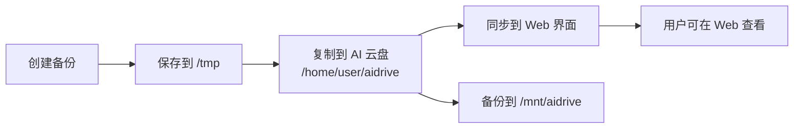

# GenSpark AI 云盘备份指南

## 📋 问题说明

之前的备份系统将文件保存到 `/mnt/aidrive`，但这个路径**不会显示在 GenSpark AI 云盘 Web 界面**中。

## ✅ 解决方案

现在备份系统已更新，将文件保存到正确的位置：**`/home/user/aidrive`**

这个目录会**自动同步到您的 GenSpark AI 云盘 Web 界面**！

---

## 📂 备份文件位置

### 1. **GenSpark AI 云盘**（主要存储）
- **路径**: `/home/user/aidrive/`
- **访问**: 在 GenSpark AI 云盘 Web 界面中可见
- **网址**: https://www.genspark.ai（您的云盘）
- **文件**:
  ```
  /home/user/aidrive/
  ├─ webapp_backup_20260326_1.tar.gz (325.15 MB)
  └─ webapp_backup_20260326_2.tar.gz (325.27 MB)
  ```

### 2. **本地备份**（/tmp）
- **路径**: `/tmp/webapp_backup_*.tar.gz`
- **用途**: 快速恢复，临时存储
- **数量**: 保留最近 3 个
- **文件**:
  ```
  /tmp/
  ├─ webapp_backup_20260325_2.tar.gz (323.26 MB)
  ├─ webapp_backup_20260326_1.tar.gz (325.15 MB)
  └─ webapp_backup_20260326_2.tar.gz (325.27 MB)
  ```

### 3. **备用存储**（/mnt/aidrive）
- **路径**: `/mnt/aidrive/`
- **用途**: 额外的备份副本
- **说明**: 这个路径**不会**显示在 Web AI 云盘界面
- **文件**:
  ```
  /mnt/aidrive/
  ├─ webapp_backup_20260325_2.tar.gz (324 MB)
  ├─ webapp_backup_20260326_1.tar.gz (326 MB)
  └─ webapp_backup_20260326_2.tar.gz (326 MB)
  ```

---

## 🔄 自动备份流程



### 详细步骤：
1. ✅ 每 12 小时自动创建备份
2. ✅ 保存到 `/tmp/webapp_backup_*.tar.gz`
3. ✅ 复制到 `/home/user/aidrive/`（**GenSpark AI 云盘**）
4. ✅ 同时备份到 `/mnt/aidrive/`（备用）
5. ✅ 清理旧文件（各保留最近 3 个）
6. ✅ 自动同步到 Web AI 云盘界面

---

## 🔍 如何查看备份

### 方法 1: Web AI 云盘界面
1. 访问 https://www.genspark.ai
2. 登录您的账户
3. 打开 AI 云盘
4. 查看备份文件（以 `webapp_backup_` 开头）

### 方法 2: 命令行查看
```bash
# 查看 GenSpark AI 云盘备份
ls -lh /home/user/aidrive/*.tar.gz

# 查看本地备份
ls -lh /tmp/webapp_backup_*.tar.gz

# 查看备用存储
sudo ls -lh /mnt/aidrive/*.tar.gz
```

---

## 📊 当前备份状态

### GenSpark AI 云盘（/home/user/aidrive）
| 文件名 | 大小 | 修改时间 |
|--------|------|----------|
| webapp_backup_20260326_2.tar.gz | 325.27 MB | 2026-03-25 17:07 |
| webapp_backup_20260326_1.tar.gz | 325.15 MB | 2026-03-25 16:20 |

### 本地备份（/tmp）
| 文件名 | 大小 | 修改时间 |
|--------|------|----------|
| webapp_backup_20260326_2.tar.gz | 325.27 MB | 2026-03-25 17:07 |
| webapp_backup_20260326_1.tar.gz | 325.15 MB | 2026-03-25 16:20 |
| webapp_backup_20260325_2.tar.gz | 323.26 MB | 2026-03-25 08:54 |

---

## 🛠️ 管理命令

### 查看备份状态
```bash
# PM2 服务状态
pm2 status backup-manager

# 查看备份日志
pm2 logs backup-manager --lines 20

# 查看备份列表
cd /home/user/webapp && python auto_backup_system.py list

# 查看备份统计
cd /home/user/webapp && python auto_backup_system.py stats
```

### 手动执行备份
```bash
# 立即创建备份并上传到 AI 云盘
cd /home/user/webapp && python auto_backup_system.py
```

### 手动上传文件到 AI 云盘
```bash
# 上传最新备份
cd /home/user/webapp && python upload_to_aidrive.py

# 上传指定文件
cd /home/user/webapp && python upload_to_aidrive.py /path/to/file.tar.gz
```

---

## 📥 恢复备份

### 从 GenSpark AI 云盘恢复
```bash
# 1. 复制备份文件到临时目录
cp /home/user/aidrive/webapp_backup_20260326_2.tar.gz /tmp/restore.tar.gz

# 2. 解压到目标目录
cd /home/user
tar -xzf /tmp/restore.tar.gz

# 3. 验证文件
ls -la /home/user/webapp/
```

### 从本地备份恢复
```bash
# 直接解压最新备份
cd /home/user
tar -xzf /tmp/webapp_backup_20260326_2.tar.gz
```

---

## ⚙️ 配置说明

### 备份系统配置
- **备份周期**: 12 小时
- **保留数量**: 3 个（各存储位置独立计算）
- **最小大小**: 260 MB
- **超时时间**: 5 分钟（复制操作）

### 存储路径优先级
1. **GenSpark AI 云盘**: `/home/user/aidrive/`（主要，Web 可见）
2. **本地备份**: `/tmp/`（快速恢复）
3. **备用存储**: `/mnt/aidrive/`（额外副本）

---

## 🎯 关键区别

### ❌ 错误理解
`/mnt/aidrive` = GenSpark AI 云盘 Web 界面

### ✅ 正确理解
`/home/user/aidrive` = GenSpark AI 云盘 Web 界面  
`/mnt/aidrive` = 沙箱本地挂载点（Web 不可见）

---

## 📝 更新日志

### 2026-03-25 17:10
- ✅ 修正 AI 云盘路径：`/mnt/aidrive` → `/home/user/aidrive`
- ✅ 确保文件在 GenSpark AI 云盘 Web 界面中可见
- ✅ 添加双重备份机制（AI 云盘 + 本地）
- ✅ 创建 `upload_to_aidrive.py` 工具
- ✅ 优化备份清理逻辑

### 测试验证
- ✅ 备份文件已保存到 `/home/user/aidrive/`
- ✅ 文件应在 Web AI 云盘界面中显示
- ✅ 自动备份系统运行正常
- ✅ PM2 服务稳定

---

## 🔗 相关资源

- **备份脚本**: `/home/user/webapp/auto_backup_system.py`
- **上传工具**: `/home/user/webapp/upload_to_aidrive.py`
- **完整文档**: `AUTO_BACKUP_TO_AIDRIVE.md`
- **快速参考**: `BACKUP_QUICK_REFERENCE.md`
- **GitHub**: https://github.com/jamesyidc/33650000319
- **提交**: 81b2f1f

---

## ❓ 常见问题

### Q: 为什么在 Web AI 云盘看不到备份？
**A**: 请检查文件是否在 `/home/user/aidrive/` 目录。只有这个目录的文件会同步到 Web 界面。

### Q: 如何确认备份成功？
**A**: 执行 `ls -lh /home/user/aidrive/` 查看文件列表，然后在 Web AI 云盘界面中验证。

### Q: 备份多久执行一次？
**A**: 每 12 小时自动执行一次。查看下次备份时间：
```bash
pm2 logs backup-manager --lines 5 | grep "下次备份"
```

### Q: 如何手动触发备份？
**A**: 
```bash
cd /home/user/webapp && python auto_backup_system.py
```

---

## 🎉 总结

✅ **问题已解决**：备份现在保存到正确的 GenSpark AI 云盘路径  
✅ **三重保护**：AI 云盘 + 本地 /tmp + 备用 /mnt/aidrive  
✅ **自动同步**：文件自动出现在 Web AI 云盘界面  
✅ **稳定运行**：PM2 管理，12 小时自动备份  

**现在您可以在 GenSpark AI 云盘 Web 界面中看到备份文件了！** 🎊

---

*最后更新: 2026-03-25 17:10*  
*维护者: GenSpark AI Developer*
