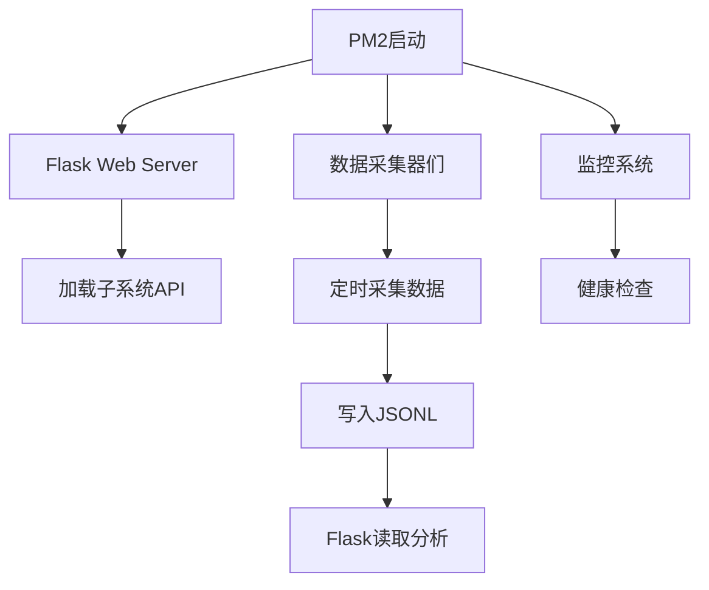

# 交易系统完整文档

## 目录
- [系统概述](#系统概述)
- [系统架构](#系统架构)
- [运行逻辑与流程](#运行逻辑与流程)
- [数据表结构](#数据表结构)
- [功能详解](#功能详解)
- [系统依赖](#系统依赖)
- [备份系统](#备份系统)

---

## 系统概述

这是一个完整的加密货币交易分析系统，集成了多个子系统用于数据采集、分析和交易信号生成。

### 核心特性
- 🔄 **实时数据采集**: 多个数据采集器并行运行
- 📊 **多维度分析**: SAR、恐慌指标、支撑压力等多种技术分析
- 🎯 **交易信号**: 自动生成买卖信号
- 🌐 **Web界面**: Flask提供的实时监控界面
- 💾 **自动备份**: 12小时自动备份，保留最近3次

---

## 系统架构

### 架构图
```
┌─────────────────────────────────────────────────────────────┐
│                      Flask Web Server                        │
│                    (core_code/app.py)                        │
│                      端口: 9002                              │
└─────────────────┬───────────────────────────────────────────┘
                  │
    ┌─────────────┴─────────────┬──────────────┬──────────────┐
    │                           │              │              │
┌───▼────┐              ┌──────▼──────┐  ┌────▼────┐   ┌────▼────┐
│  数据   │              │   分析系统  │  │  信号   │   │  监控   │
│ 采集器  │              │             │  │  生成   │   │  系统   │
└───┬────┘              └──────┬──────┘  └────┬────┘   └────┬────┘
    │                           │              │              │
    └────────────┬──────────────┴──────┬───────┴──────────────┘
                 │                     │
         ┌───────▼────────┐    ┌──────▼──────┐
         │  JSONL 数据库  │    │  PM2 管理   │
         │  (data/)       │    │             │
         └────────────────┘    └─────────────┘
```

### 目录结构
```
/home/user/webapp/
├── core_code/              # 核心代码
│   ├── app.py             # Flask主应用
│   └── *.py               # 各种分析脚本
├── source_code/           # 源代码模块
├── panic_paged_v2/        # 恐慌指标v2
├── panic_v3/              # 恐慌指标v3
├── special_systems/       # 特殊系统
├── templates/             # HTML模板
│   └── backup_manager.html
├── static/                # 静态资源
├── data/                  # 数据存储 (~3.6GB)
│   ├── sar_jsonl/        # SAR指标数据
│   ├── support_resistance_daily/  # 支撑压力日数据
│   ├── support_resistance_jsonl/  # 支撑压力数据
│   ├── anchor_daily/     # 锚点日数据
│   ├── price_speed_jsonl/ # 价格速度数据
│   └── ...
├── auto_backup_system.py  # 备份脚本
├── backup_scheduler.py    # 备份调度器
└── requirements.txt       # Python依赖

```

---

## 运行逻辑与流程

### 1. 系统启动流程


### 2. 数据流转流程
```
外部API (OKX等)
    ↓
数据采集器 (PM2守护)
    ↓
JSONL文件 (data/)
    ↓
Flask后端分析
    ↓
Web前端展示
    ↓
用户决策
```

### 3. 备份流程
```
backup_scheduler.py (PM2)
    ↓ (每12小时)
auto_backup_system.py
    ↓
tar打包 (排除.git)
    ↓
压缩为.tar.gz (~265MB)
    ↓
保存到/tmp
    ↓
清理旧备份 (保留最近3次)
    ↓
记录到backup_history.jsonl
```

---

## 数据表结构

### 1. SAR指标数据 (`data/sar_jsonl/*.jsonl`)
每个币种一个文件，如 `BTC.jsonl`

**字段结构**:
```json
{
  "timestamp": "2026-03-15T10:30:00+08:00",
  "coin": "BTC",
  "price": 65432.10,
  "sar": 64500.00,
  "sar_af": 0.02,
  "sar_direction": "bull",
  "sar_switch": false
}
```

**字段说明**:
- `timestamp`: 北京时间时间戳
- `coin`: 币种代码
- `price`: 当前价格
- `sar`: SAR指标值
- `sar_af`: SAR加速因子
- `sar_direction`: SAR方向 (bull/bear)
- `sar_switch`: 是否发生反转

### 2. 支撑压力数据 (`data/support_resistance_jsonl/support_resistance_levels.jsonl`)
**最大文件**: 697MB (未压缩)

**字段结构**:
```json
{
  "timestamp": "2026-03-15T10:30:00+08:00",
  "coin": "BTC",
  "support_levels": [64000, 63500, 63000],
  "resistance_levels": [66000, 66500, 67000],
  "current_price": 65432.10,
  "strength": "strong"
}
```

**字段说明**:
- `support_levels`: 支撑位数组
- `resistance_levels`: 压力位数组
- `strength`: 强度 (weak/medium/strong)

### 3. 支撑压力日数据 (`data/support_resistance_daily/*.jsonl`)
按日期存储，如 `support_resistance_20260315.jsonl`

**总大小**: ~977MB
**文件数**: 41个
**每日数据**: 24-40MB

### 4. 恐慌清洗指标 (`data/panic_jsonl/panic_wash_index.jsonl`)
**字段结构**:
```json
{
  "timestamp": "2026-03-15T10:30:00+08:00",
  "panic_index": 65.5,
  "wash_index": 42.3,
  "market_state": "fear",
  "signals": ["potential_bottom", "buy_zone"]
}
```

### 5. 市场情绪 (`data/market_sentiment/market_sentiment_*.jsonl`)
**按日期存储**

**字段结构**:
```json
{
  "timestamp": "2026-03-15T10:30:00+08:00",
  "sentiment_score": 6.5,
  "fear_greed_index": 45,
  "market_mood": "neutral",
  "volume_trend": "increasing"
}
```

### 6. 锚点数据 (`data/anchor_daily/*.jsonl`)
**总大小**: 191MB

**字段结构**:
```json
{
  "timestamp": "2026-03-15T10:30:00+08:00",
  "coin": "BTC",
  "anchor_price": 65000.00,
  "deviation": 0.66,
  "signal": "hold"
}
```

### 7. 价格速度 (`data/price_speed_jsonl/*.jsonl`)
**总大小**: 173MB

**字段结构**:
```json
{
  "timestamp": "2026-03-15T10:30:00+08:00",
  "coin": "BTC",
  "speed_1m": 0.05,
  "speed_5m": 0.12,
  "speed_15m": 0.25,
  "acceleration": 0.02
}
```

### 8. 备份历史 (`data/backup_history.jsonl`)
**字段结构**:
```json
{
  "timestamp": "2026-03-15T18:48:48+08:00",
  "filename": "webapp_backup_20260316_1.tar.gz",
  "filepath": "/tmp/webapp_backup_20260316_1.tar.gz",
  "size": 278344704,
  "size_formatted": "265.42 MB",
  "status": "success",
  "file_stats": {
    "python": {"count": 401, "size": "5.38 MB"},
    "markdown": {"count": 17, "size": "174.74 KB"},
    "html": {"count": 289, "size": "14.02 MB"},
    "config": {"count": 290, "size": "3.20 MB"},
    "data": {"count": 931, "size": "2.97 GB"},
    "logs": {"count": 38, "size": "1.52 MB"},
    "other": {"count": 1359, "size": "167.30 MB"}
  }
}
```

### 9. OKX交易日志 (`data/okx_trading_logs/trading_log_*.jsonl`)
**按日期存储**

**字段结构**:
```json
{
  "timestamp": "2026-03-15T10:30:00+08:00",
  "coin": "BTC",
  "action": "buy",
  "price": 65432.10,
  "amount": 0.01,
  "total": 654.32,
  "status": "filled"
}
```

### 10. SAR Bias统计 (`data/sar_bias_stats/bias_stats_*.jsonl`)
**按日期存储**

**字段结构**:
```json
{
  "timestamp": "2026-03-15T10:30:00+08:00",
  "coin": "BTC",
  "bias": 1.45,
  "sar_price_ratio": 0.9856,
  "trend": "bullish"
}
```

---

## 功能详解

### 1. Flask Web Server
**文件**: `core_code/app.py`
**端口**: 9002
**进程名**: flask-app

**核心功能**:
- 提供Web界面
- API路由管理
- 子系统集成
- 实时数据展示

**主要路由**:
- `/` - 主页
- `/backup-manager` - 备份管理页面
- `/api/backup/status` - 备份状态API
- `/api/backup/trigger` - 触发备份API
- `/api/price-position/*` - 价格仓位API
- `/api/subsystem/*` - 子系统API

### 2. 数据采集系统

#### 2.1 币价追踪器 (coin-price-tracker)
**功能**: 实时追踪币价变化
**频率**: 高频采集
**输出**: `data/sar_jsonl/*.jsonl`

#### 2.2 币种变化追踪 (coin-change-tracker)
**功能**: 追踪币种价格变化率
**频率**: 定时采集
**输出**: 价格变化数据

#### 2.3 SAR指标采集 (sar-jsonl-collector)
**功能**: 采集SAR技术指标
**频率**: 定时采集
**输出**: `data/sar_jsonl/*.jsonl`

#### 2.4 支撑压力采集 (support-resistance-collector)
**功能**: 计算支撑压力位
**频率**: 定时采集
**输出**: `data/support_resistance_jsonl/*.jsonl`

#### 2.5 市场情绪采集 (market-sentiment-collector)
**功能**: 采集市场情绪指标
**频率**: 定时采集
**输出**: `data/market_sentiment/*.jsonl`

#### 2.6 恐慌清洗采集 (panic-wash-collector)
**功能**: 采集恐慌清洗指标
**频率**: 定时采集
**输出**: `data/panic_jsonl/*.jsonl`

#### 2.7 价格速度采集 (price-speed-collector)
**功能**: 计算价格变化速度
**频率**: 高频采集
**输出**: `data/price_speed_jsonl/*.jsonl`

#### 2.8 新高新低采集 (new-high-low-collector)
**功能**: 记录新高新低
**频率**: 定时采集

#### 2.9 价格基准采集 (price-baseline-collector)
**功能**: 采集价格基准线
**频率**: 定时采集

#### 2.10 清算数据采集 (liquidation-1h-collector)
**功能**: 采集1小时清算数据
**频率**: 每小时

### 3. 分析系统

#### 3.1 SAR Bias统计
**功能**: 统计SAR偏离度
**输出**: `data/sar_bias_stats/*.jsonl`

#### 3.2 支撑压力分析
**功能**: 分析支撑压力位强度和有效性

#### 3.3 恐慌指标分析
**功能**: 分析市场恐慌程度，寻找底部信号

#### 3.4 锚点分析
**功能**: 计算价格锚点，判断偏离度

### 4. 监控系统

#### 4.1 数据健康监控 (data-health-monitor)
**功能**: 监控数据采集状态
**检查项**:
- 数据文件完整性
- 数据更新频率
- 数据质量

#### 4.2 系统健康监控 (system-health-monitor)
**功能**: 监控系统运行状态
**检查项**:
- PM2进程状态
- 内存使用率
- CPU使用率
- 磁盘空间

#### 4.3 信号采集监控 (signal-collector)
**功能**: 监控信号生成
**检查项**:
- 信号生成频率
- 信号质量

### 5. 备份系统

#### 5.1 自动备份 (backup_scheduler.py)
**PM2进程名**: backup-scheduler (如已启动)
**频率**: 12小时
**保留**: 最近3次

**备份内容**:
- ✅ Python文件: 401个 (5.38 MB)
- ✅ HTML模板: 289个 (14.02 MB)
- ✅ Markdown文档: 17个 (174.74 KB)
- ✅ 配置文件: 290个 (3.20 MB)
- ✅ 数据文件: 931个 (2.97 GB)
- ✅ 日志文件: 38个 (1.52 MB)
- ✅ 其他文件: 1359个 (167.30 MB)

**排除内容**:
- ❌ .git目录

**压缩比**: ~12:1 (3.16GB → 265MB)

#### 5.2 手动备份
```bash
cd /home/user/webapp
python3 auto_backup_system.py
```

#### 5.3 备份恢复
```bash
# 解压备份
cd /home/user
tar -xzf /tmp/webapp_backup_20260316_1.tar.gz

# 安装依赖
cd /home/user/webapp
pip install -r requirements.txt

# 启动服务
pm2 start ecosystem.*.json
```

---

## 系统依赖

### Python包 (requirements.txt)
```
Flask==3.0.0                # Web框架
Flask-Compress==1.14        # 压缩中间件
requests==2.31.0            # HTTP请求
pytz==2023.3                # 时区处理
pandas==2.1.4               # 数据处理
numpy==1.26.2               # 数值计算
python-dotenv==1.0.0        # 环境变量
cryptography==41.0.7        # 加密
ccxt==4.2.0                 # 加密货币交易API
schedule==1.2.0             # 任务调度
```

### Node.js包
无Node.js依赖，纯Python项目

### PM2进程管理

**活跃进程** (18个):
```
1.  flask-app                        # Flask主应用
2.  coin-change-tracker             # 币种变化追踪
3.  coin-price-tracker              # 币价追踪
4.  crypto-index-collector          # 加密指数采集
5.  data-health-monitor             # 数据健康监控
6.  financial-indicators-collector  # 金融指标采集
7.  liquidation-1h-collector        # 清算数据采集
8.  market-sentiment-collector      # 市场情绪采集
9.  new-high-low-collector          # 新高新低采集
10. okx-day-change-collector        # OKX日变化采集
11. panic-wash-collector            # 恐慌清洗采集
12. price-baseline-collector        # 价格基准采集
13. price-comparison-collector      # 价格比较采集
14. price-speed-collector           # 价格速度采集
15. sar-bias-stats-collector        # SAR偏离统计采集
16. sar-jsonl-collector             # SAR数据采集
17. signal-collector                # 信号采集
18. system-health-monitor           # 系统健康监控
```

**PM2命令**:
```bash
# 查看所有进程
pm2 list

# 查看日志
pm2 logs flask-app
pm2 logs backup-scheduler

# 重启进程
pm2 restart flask-app

# 启动备份调度器
pm2 start backup_scheduler.py --name backup-scheduler --interpreter python3

# 保存PM2配置
pm2 save
```

### 环境变量
存储在 `.env` 文件或系统环境变量中:

```bash
# Flask配置
FLASK_ENV=production
FLASK_PORT=9002

# 数据目录
DATA_DIR=/home/user/webapp/data

# 备份配置
BACKUP_DIR=/tmp
BACKUP_INTERVAL=43200  # 12小时（秒）
MAX_BACKUPS=3
```

### 数据目录结构
```
/home/user/webapp/data/
├── sar_jsonl/              # SAR指标 (~46MB, 多文件)
├── support_resistance_daily/  # 支撑压力日数据 (~977MB, 41文件)
├── support_resistance_jsonl/  # 支撑压力数据 (~740MB, 4文件)
│   └── support_resistance_levels.jsonl  # 最大文件 (697MB)
├── anchor_daily/          # 锚点日数据 (~191MB)
├── anchor_profit_stats/   # 锚点收益统计 (~163MB)
├── price_speed_jsonl/     # 价格速度 (~173MB)
├── v1v2_jsonl/           # v1v2数据 (~108MB)
├── panic_jsonl/          # 恐慌指标
├── market_sentiment/     # 市场情绪
├── sar_bias_stats/       # SAR偏离统计
├── okx_trading_logs/     # OKX交易日志
└── backup_history.jsonl  # 备份历史记录
```

**总大小**: ~3.6GB (未压缩)

### 系统要求
- Python 3.8+
- PM2 (Node.js进程管理器)
- 至少4GB内存
- 至少10GB磁盘空间
- Linux/Unix系统

---

## API接口文档

### 备份管理API

#### 1. 获取备份状态
```http
GET /api/backup/status
```

**响应**:
```json
{
  "success": true,
  "backups": [
    {
      "filename": "webapp_backup_20260316_2.tar.gz",
      "size_mb": 265.42,
      "timestamp": "2026-03-16 02:56:32",
      "size_formatted": "265.42 MB"
    }
  ],
  "total_backups": 3,
  "total_size_formatted": "796.27 MB",
  "next_backup_time": "2026-03-16 14:56:32",
  "next_backup_countdown": "11小时58分钟",
  "backup_interval_hours": 12
}
```

#### 2. 触发备份
```http
POST /api/backup/trigger
```

**响应**:
```json
{
  "success": true,
  "message": "备份任务已启动",
  "pid": 12345
}
```

### 价格仓位API
```http
GET /api/price-position/*
```

### 子系统API
```http
GET /api/subsystem/*
```

---

## 故障排查

### 常见问题

#### 1. Flask应用无法访问
```bash
# 检查进程
pm2 list | grep flask-app

# 查看日志
pm2 logs flask-app --lines 50

# 重启
pm2 restart flask-app
```

#### 2. 数据未更新
```bash
# 检查采集器
pm2 list

# 查看特定采集器日志
pm2 logs coin-price-tracker

# 重启采集器
pm2 restart coin-price-tracker
```

#### 3. 备份失败
```bash
# 检查磁盘空间
df -h /tmp

# 手动执行备份
cd /home/user/webapp
python3 auto_backup_system.py

# 查看备份历史
cat data/backup_history.jsonl | tail -5
```

#### 4. PM2进程崩溃
```bash
# 查看崩溃日志
pm2 logs --err

# 重启所有进程
pm2 restart all

# 重新加载配置
pm2 start ecosystem.*.json
```

### 性能监控

```bash
# 查看系统资源
pm2 monit

# 查看内存使用
pm2 list

# 查看磁盘使用
du -sh /home/user/webapp/*

# 查看数据目录大小
du -sh /home/user/webapp/data/*
```

---

## 版本信息

- **系统版本**: v1.0
- **最后更新**: 2026-03-16
- **Python版本**: 3.8+
- **Flask版本**: 3.0.0

---

## 联系与支持

如有问题，请查看:
1. `/home/user/webapp/BACKUP_SYSTEM.md` - 备份系统文档
2. `/home/user/webapp/REDEPLOYMENT_GUIDE.md` - 重新部署指南
3. `/home/user/webapp/BACKUP_NAMING_GUIDE.md` - 备份命名规则

---

**文档生成时间**: 2026-03-16 03:00:00 (北京时间)
